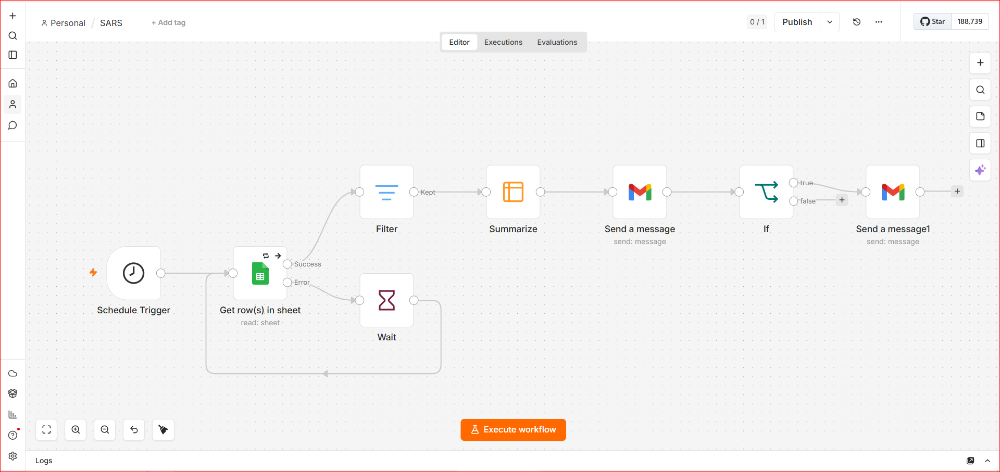
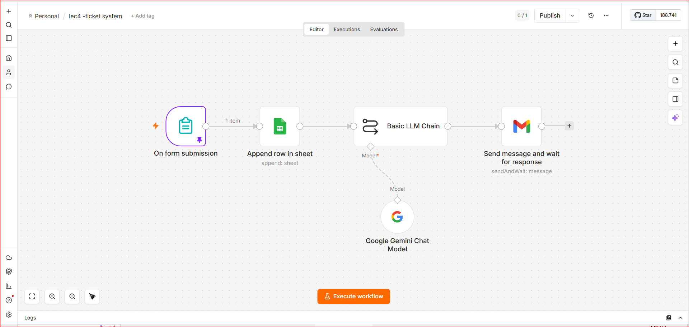

# AI & Automation Production-Ready Workflows (Portfolio)

A collection of advanced automation pipelines and AI-driven workflows built during an intensive technical workshop, focusing on data engineering, automated alerting, and systems integration.

---

## 📌 Project 1: Daily Revenue Automation & Alerting System (SARS)

An automated data pipeline built with **n8n** to fetch, filter, and summarize daily sales data from Google Sheets, send beautifully formatted HTML reports to the sales manager, and trigger escalation alerts to the CEO if daily targets are not met.

### ⚙️ Workflow Architecture & Logic
1. **Schedule Trigger:** Runs automatically every day at 23:59 to process the full day's data.
2. **Data Ingestion (Google Sheets):** Fetches recent transaction logs and revenue data.
3. **Time-Based Filtering:** Filters rows dynamically to match only the current date (`$now.toFormat('MM/d/y')`).
4. **Data Aggregation:** Summarizes and calculates the total `sum_Revenue` for the day.
5. **Manager Reporting (Gmail):** Sends an automated, styled HTML/CSS email report showing the total daily revenue.
6. **Conditional Escalation (IF Logic):** Checks if the total revenue is less than **$1,500**. If true, it triggers an immediate email notification to the CEO alerting them that the daily target was missed.
7. **Error Handling & Retry:** Includes a "Wait & Retry" loop mechanism to re-fetch data from Google Sheets if the initial request fails.

### 🛠️ Tech Stack & Tools
* **Automation Platform:** n8n
* **Data Source:** Google Sheets API
* **Communication & Alerting:** Gmail API (OAuth2)
* **Frontend/Formatting:** HTML5 & CSS3 (For structured email templates)
* **Expression Language:** JavaScript / n8n Expressions

---

## 📌 Project 2: AI-Powered Smart Helpdesk & Ticketing System

An intelligent, automated ticketing system that handles incoming internal support forms, archives them in Google Sheets, and utilizes **Gemini 2.5 Flash LLM (via LangChain)** to dynamically analyze, classify, prioritize, and route the issues.

### ⚙️ Workflow Architecture & Logic
1. **Form Trigger:** Captures incoming employee complaints/tickets (Name, Email, Problem Description).
2. **Data Logging:** Appends the raw ticket details immediately into Google Sheets for historical archiving.
3. **AI Analysis (Basic LLM Chain):** Passes the problem description to **Gemini 2.5 Flash** using LangChain. 
4. **Smart Classification & Prioritization:** The LLM executes custom prompt engineering logic to classify the ticket department (**IT Department** vs. **HR Department**), determine severity levels, and calculate a dynamic resolution deadline.
5. **Dynamic HTML Generation:** The LLM formats the final output into a responsive, styled HTML alert template.
6. **Human-in-the-Loop Routing:** Sends the generated HTML alert via Gmail to the responsible team and utilizes the **Send Message & Wait for Response** node to hold for an internal human action (e.g., assigning a specific HR member like Rama or Sham via a dropdown menu).

### 🛠️ Tech Stack & Tools
* **Automation Platform:** n8n
* **AI Orchestration:** LangChain Nodes inside n8n
* **LLM Engine:** Google Gemini 2.5 Flash Chat Model
* **Data Logging:** Google Sheets API
* **Notification & Interaction:** Gmail API (with Wait-for-Response Webhooks)

* ---

## 📌 Project 3: AI School Feedback Sentiment & Insight Analyzer

An end-to-end AI-powered data processor that monitors school feedback forms, uses **Gemini 2.5 Flash** to run instant sentiment analysis, extracts structured, detailed operational insights from parent opinions, and logs/notifies management dynamically.

### ⚙️ Workflow Architecture & Logic
1. **Google Sheets Trigger:** Fires instantly whenever a new school/staff evaluation response is added.
2. **Sentiment Classification (LLM Agent 1):** Passes the review to **Gemini 2.5 Flash** to categorize the emotional tone strictly into one Arabic word: `إيجابي` (Positive), `سلبي` (Negative), or `محايد` (Neutral).
3. **Database Logging (Step 1):** Updates the row in Google Sheets with the calculated sentiment categorization.
4. **Insight Extraction (LLM Agent 2):** Processes the same text to extract specific bullet-pointed feedback regarding key aspects (e.g., Teaching Quality, Facilities, Cleanliness, Administration).
5. **Database Logging (Step 2):** Logs the highly structured bullet points back into the spreadsheet.
6. **Executive Alerting (Gmail API):** Combines the overall sentiment and the extracted points, then sends a neat text alert to the administration for rapid response.

### 🛠️ Tech Stack & Tools
* **Automation Platform:** n8n
* **AI Engine:** Google Gemini 2.5 Flash (via LangChain Integration)
* **Data Core:** Google Sheets API (Polling & Conditional Updating)
* **Alerting System:** Gmail API
